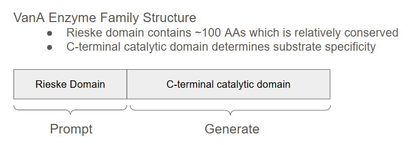

# bio_ai_agent_genslm_example
GenSLM sequence generation example to be incorporated into agentic workflows 



# Install GenSLM on aurora

```
module load frameworks
module load tmux

pip install levenshtein

pip install git+https://github.com/ramanathanlab/genslm
```

# Generate Sequences

```
cd example
python generate.py
python compute_similarity.py
```

I forced to use CPU in `generate.util.py` line 18 and it takes 1min to generate 10 seqs from a prompt. Using XPU will cause OOM when generate 10 seqs at once: `model.model.generate(..., num_outputs = 10)`